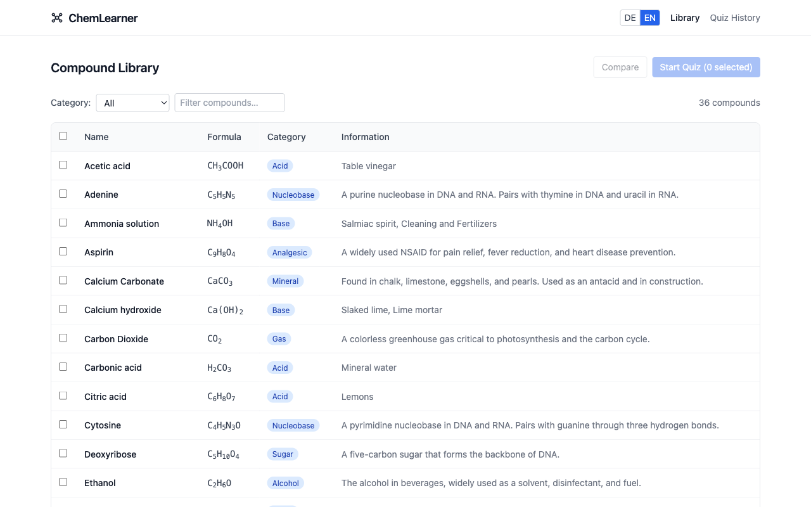
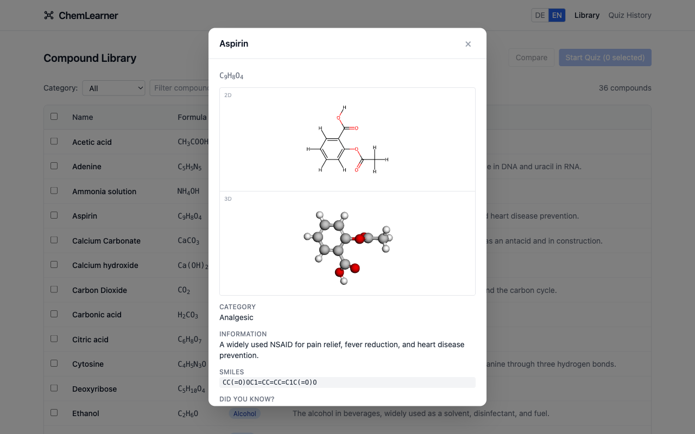
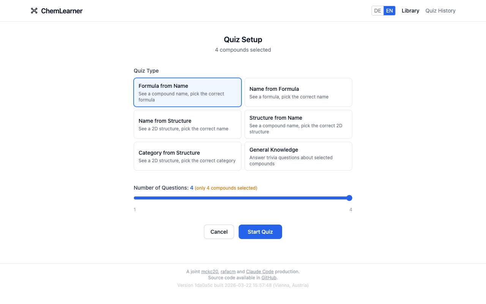
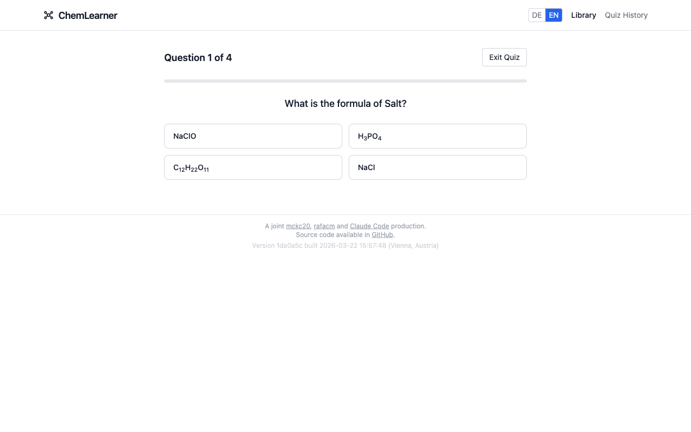
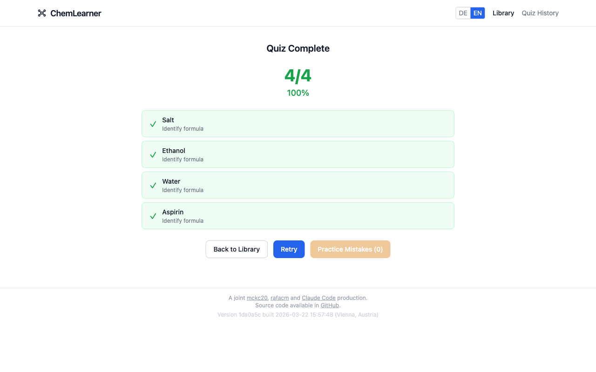
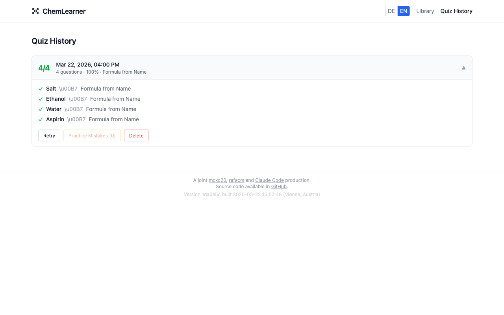

# ChemLearner 3D

A web application for managing chemical compound libraries, visualizing molecules in interactive 2D/3D, and testing knowledge through dynamic quizzes. Available in English and German.

## Screenshots

### Compound Library
Browse 36 pre-loaded compounds with category and text filters, select compounds for quizzes or CSV export.



### Compound Viewer
Click any compound to see its 2D skeletal structure (RDKit), interactive 3D model (3Dmol.js), educational facts, and external links.



### Quiz Setup
Choose from 6 quiz types, adjust the number of questions, and start learning.



### Quiz Question
Multiple-choice questions with properly rendered chemical formulas (subscripts and superscripts).



### Quiz Results
Color-coded score with per-question breakdown. Retry or practice only your mistakes.



### Quiz History
Review past quiz results, retry quizzes, or practice mistakes from any previous session.



---

## Features

### Compound Library
- **36 pre-loaded compounds** spanning acids, bases, sugars, nucleobases, explosives, and more
- Category filter dropdown and free-text search across all fields
- Select compounds via checkboxes for quizzes or CSV export
- Click any compound name to open a detailed viewer
- Data persisted in browser `localStorage` with automatic migrations across versions

### Molecular Visualization
- **2D skeletal structures** generated via RDKit.js (WASM)
- **Interactive 3D models** rendered with 3Dmol.js (ball-and-stick style, rotatable)
- SDF molblocks fetched from PubChem (3D preferred, 2D fallback for ionic compounds)
- Ambiguity detection when a formula matches multiple isomers
- Educational facts, SMILES notation, and links to Wikipedia, PubChem, and Wikidata

### Quiz Mode
- **6 quiz types:**
  - Formula from Name
  - Name from Formula
  - Name from Structure (2D model prompt)
  - Structure from Name (visual multiple choice)
  - Category from Structure
  - General Knowledge (100+ fact-based questions)
- Configurable question count (1-10)
- Color-coded results with per-question breakdown
- **Quiz history** with retry and practice-mistakes features

### Internationalization
- Full English and German support (UI, compound names, facts, quiz questions)
- Language auto-detected from browser settings
- DE/EN toggle in the header

---

## Technology Stack

| Layer | Technology |
|---|---|
| Framework | React (Vite) |
| Styling | Tailwind CSS (auto dark/light via `prefers-color-scheme`) |
| 3D Rendering | 3Dmol.js |
| 2D Structures | RDKit.js (WASM, CDN) |
| Compound Data | PubChem PUG REST (SDF molblocks fetched directly) |
| CSV Parsing | PapaParse |
| Persistence | Browser `localStorage` |
| Deployment | Netlify |

---

## Getting Started

```bash
npm install          # Install dependencies
npm run dev          # Start dev server
npm run build        # Production build
npm run lint         # Run ESLint
npm test             # Run all tests
```

---

## CSV Data Schema

The application can export compound data as CSV with these columns:

| Column | Description | Example |
|---|---|---|
| `Name` | Common name | `Water` |
| `Formula` | Chemical formula | `H2O` |
| `Category` | Functional group or class | `Solvent`, `Acid` |
| `Information` | Educational context | *(free text)* |
| `WikipediaUrl` | Link to Wikipedia article | |
| `PubchemUrl` | Link to PubChem compound page | |
| `WikidataId` | Wikidata entity ID | `Q283` |
| `SMILES` | SMILES notation | `O` |

---

## Credits

A joint [mckc20](https://github.com/mckc20/), [rafacm](https://github.com/rafacm), and [Claude Code](https://claude.ai/code) production.
